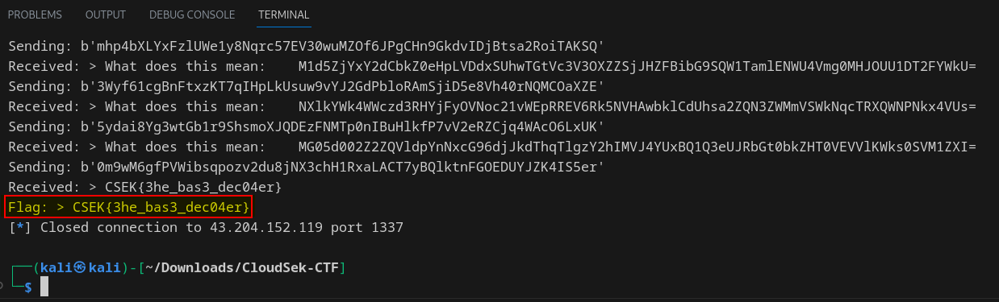

# Bases

> Do you Know Your Bases?

> nc 43.204.152.119 1337

## Solution

- On using netcat to connect to the IP and port, we are given a base64 encoded string. For which we have to decode it and give as an answer.
- Upon giving the correct decoded string, we get another encoded string which we have to decode and on giving a wrong answer, the connection closes
- We can use the `pwntools` library in python to solve this.
- Using the below [script.py](bases_script.py) we get the flag

```python
# Importing required modules
from pwn import *
import base64

# Connecting to the remote target
io = remote('43.204.152.119', 1337)

# Function to decode the base64 string
def decode_base64(data):
    return base64.b64decode(data)

# Loop to receive and decode the base64 string, until the flag is obtained
while True:
		# Receiving data fromm server and printing out only the base64 string
    received_data = io.recvline().decode().strip()
    print("Received:", received_data)
		
		# Checking if the data contains the flag in the specific format
    if "CSEK{" in received_data:
        print("Flag:", received_data)
        break
    
		# Extract base64 encoded string 
    encoded_data = received_data.split(":")[1].strip()
		
		# Decode the base64 data
    decoded_data = decode_base64(encoded_data)

		# Send the decoded data back to the server
    io.sendline(decoded_data)
    print("Sending:", decoded_data)

io.close()
```

- After running the script for a few seconds we get the flag



### FLAG
```
CSEK{3he_bas3_dec04er}
```