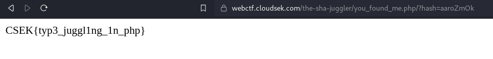

# The SHA Juggler

> Dive into the depths of "The SHA Juggler," a mysterious web challenge that tests your prowess in PHP type juggling, cunning encoding techniques, and web exploitation. Your mission is to outwit the system, leveraging the peculiarities of PHP type comparisons, decipher the applied encodings, and exploit vulnerabilities to retrieve the concealed flag. Can you navigate the enigmatic interplay of types and encodings and emerge victorious? 


## Solution

- On viewing the page source (`Ctrl + U`), we find some hex data in the `script` tag
    
    ```html
    <script>
        const isThisNormal = "50 44 39 77 61 48 41 4b 4c 79 38 67 65 57 39 31 58 32 5a 76 64 57 35 6b 58 32 31 6c 4c 6e 42 6f 63 41 70 70 5a 69 41 6f 61 58 4e 7a 5a 58 51 6f 4a 46 39 48 52 56 52 62 4a 32 68 68 63 32 67 6e 58 53 6b 70 49 48 73 4b 49 43 41 67 49 47 6c 6d 49 43 67 6b 58 30 64 46 56 46 73 6e 61 47 46 7a 61 43 64 64 49 44 30 39 50 53 41 69 4d 54 41 35 4d 7a 49 30 4d 7a 55 78 4d 54 49 69 4b 53 42 37 43 69 41 67 49 43 41 67 49 43 41 67 5a 47 6c 6c 4b 43 64 45 62 79 42 35 62 33 55 67 64 47 68 70 62 6d 73 67 61 58 52 7a 49 48 52 6f 59 58 51 67 5a 57 46 7a 65 54 38 2f 4a 79 6b 37 43 69 41 67 49 43 42 39 43 69 41 67 49 43 41 6b 61 47 46 7a 61 43 41 39 49 48 4e 6f 59 54 45 6f 4a 46 39 48 52 56 52 62 4a 32 68 68 63 32 67 6e 58 53 6b 37 43 69 41 67 49 43 41 6b 64 47 46 79 5a 32 56 30 49 44 30 67 63 32 68 68 4d 53 67 78 4d 44 6b 7a 4d 6a 51 7a 4e 54 45 78 4d 69 6b 37 43 69 41 67 49 43 42 70 5a 69 67 6b 61 47 46 7a 61 43 41 39 50 53 41 6b 64 47 46 79 5a 32 56 30 4b 53 42 37 43 69 41 67 49 43 41 67 49 43 41 67 61 57 35 6a 62 48 56 6b 5a 53 67 6e 5a 6d 78 68 5a 79 35 77 61 48 41 6e 4b 54 73 4b 49 43 41 67 49 43 41 67 49 43 42 77 63 6d 6c 75 64 43 41 6b 5a 6d 78 68 5a 7a 73 4b 49 43 41 67 49 48 30 67 5a 57 78 7a 5a 53 42 37 43 69 41 67 49 43 41 67 49 43 41 67 63 48 4a 70 62 6e 51 67 49 6b 4e 54 52 55 74 37 62 6a 42 66 4e 47 78 68 5a 31 38 30 58 33 56 39 49 6a 73 4b 49 43 41 67 49 48 30 4b 66 53 41 4b 50 7a 34 3d";
    </script>
    ```
    

- Using [CyberChef](https://gchq.github.io/CyberChef/), decoding with hex first and then base64 we get this
    
    ```php
    <?php
    // you_found_me.php
    if (isset($_GET['hash'])) {
        if ($_GET['hash'] === "10932435112") {
            die('Do you think its that easy??');
        }
        $hash = sha1($_GET['hash']);         
        $target = sha1(10932435112);         
        if($hash == $target) {
            include('flag.php');
            print $flag;
        } else {
            print "CSEK{n0_4lag_4_u}";
        }
    } 
    ?>
    ```
    

- From the code we can conclude the following things:
    - `you_found_me.php` : possible php page
    - `$_GET['hash']` : looking for a `hash` GET parameter in the URL
    - `$hash = sha1($_GET['hash'])` : Computes the hash SHA1 hash of the value provided in the `hash` parameter in the URL and stores it in the `$hash` variable.
    - `$target = sha1(10932435112)` : Computes sha1 hash of `10932435112` and stores it in `$target` variable which evaluates to  `0e07766915004133176347055865026311692244`
    - Below block of code compares the `$hash` and `$target` hash values, but the comparison which is taking place is a **LOOSE COMPARISON.**
        - There are two modes of comparison in PHP: **STRICT** and **LOOSE**.
        - In Loose comparison, **Only value** is checked and **NOT** the type of the variable.
        
        ```PHP
        if($hash == $target) {
            include('flag.php');
            print $flag;
        } 
        ```
        
    - So, if we provide a string whose hash value starts with `0e`  in the URL as a GET parameter, we can get the flag.
    - Using this [**repo**](https://github.com/spaze/hashes/blob/master/sha1.md), we see that there are many hashes whose value start with `0e`.
    - Our final payload evaluates to this:
        
        ```html
        /you_found_me.php/?hash=aaroZmOk
        ```
        
    - Appending the payload to the URL gives us the flag.
    
    
    
    | **Loose Comparison** | **Strict Comparison** |
    | --- | --- |
    | Only value is checked and NOT the type of the variable | Both value and Type are checked |
    | == or != | === or !== |

### **FLAG: `CSEK{typ3_juggl1ng_1n_php}`**
