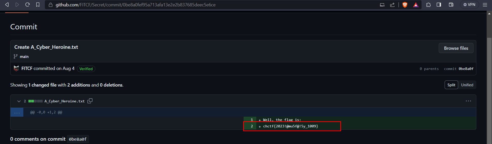

# Stephanie Wehner

## Description
> Stephanie Dorothea Christine Wehner (born 8 May 1977 in Würzburg) is a German physicist and computer scientist. She is the Roadmap Leader of the Quantum Internet and Networked Computing initiative at QuTech, Delft University of Technology.She is also known for introducing the noisy-storage model in quantum cryptography. Wehner's research focuses mainly on quantum cryptography and quantum communications. - Wikipedia Entry

> Chal: We had the flag in notepad but it crashed. Please return the flag to this Quantum Cryptographer

## Attachments
[Drive Link](https://drive.google.com/file/d/1wFihQD4zdespZx1Bjw5fV_zANoNrJg9k/view)  
OR  
[Memory Dump](./Dr.Quantum.zip)


## Solution
* We are given with a memory dump of a windows machine, a `.vmem` file.
* We can use `volatility` to analyze the memory dump.
* Using the `imageinfo` plugin, we can get the profile of the machine.
```
vol2 -f 564d38b5-422f-6f97-6068-7ea242ed6857.vmem imageinfo
```

```shell
$ vol2 -f 564d38b5-422f-6f97-6068-7ea242ed6857.vmem imageinfo                                               
Volatility Foundation Volatility Framework 2.6
INFO    : volatility.debug    : Determining profile based on KDBG search...
          Suggested Profile(s) : Win8SP0x64, Win81U1x64, Win2012R2x64_18340, Win2012R2x64, Win2012x64, Win8SP1x64_18340, Win8SP1x64 (Instantiated with Win8SP1x64)
                     AS Layer1 : WindowsAMD64PagedMemory (Kernel AS)
                     AS Layer2 : FileAddressSpace (/home/kali/Documents/Personal/CTFs/Files/CyberHeroines-CTF/Stephanie_Wehner/564d38b5-422f-6f97-6068-7ea242ed6857.vmem)
                      PAE type : No PAE
                           DTB : 0x1a7000L
                          KDBG : 0xf8037feaba30L
          Number of Processors : 1
     Image Type (Service Pack) : 0
                KPCR for CPU 0 : 0xfffff8037ff06000L
             KUSER_SHARED_DATA : 0xfffff78000000000L
           Image date and time : 2023-08-03 21:21:54 UTC+0000
     Image local date and time : 2023-08-03 17:21:54 -0400
```

* We can see that the profile is `Win8SP0x64`.
* We can use the `pslist` plugin to list all the processes running on the machine.
```python
vol2 -f 564d38b5-422f-6f97-6068-7ea242ed6857.vmem --profile=Win8SP0x64 pslist
```
* We can see that the notepad process has the pid `2452`.
```shell
$ vol2 -f 564d38b5-422f-6f97-6068-7ea242ed6857.vmem --profile=Win8SP0x64 pslist | grep 'notepad'
Volatility Foundation Volatility Framework 2.6
0xffffe000021c3900 notepad.exe            2452   1180      2        0      1      0 2023-08-03 21:20:36 UTC+0000
```
* Dump the notepad process using the `memdump` plugin and the `pid` of the notepad process.
```python
vol2 -f 564d38b5-422f-6f97-6068-7ea242ed6857.vmem --profile=Win8SP0x64 memdump --pid=2452 --dump-dir=dump 
```
* Runnings `strings` 
```
strings -e l 2452.dmp | less
```
* Scrolling through the output gives us a github link: https://github.com/FITCF
* It contains a single repository `secret`
* Checking the commits, the first commit has the flag  



### FLAG
```
chctf{2023!@mu5f@!5y_1009}
```
