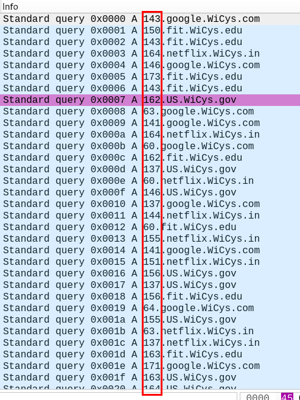
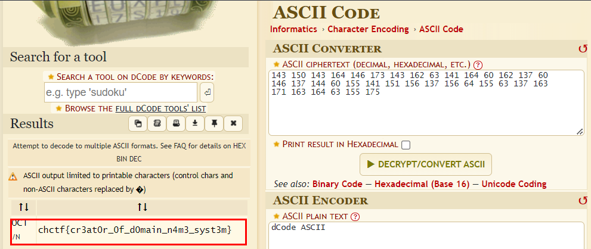

# Elizabeth Feinler


## Description
> Elizabeth Jocelyn "Jake" Feinler (born March 2, 1931) is an American information scientist. From 1972 until 1989 she was director of the Network Information Systems Center at the Stanford Research Institute (SRI International). Her group operated the Network Information Center (NIC) for the ARPANET as it evolved into the Defense Data Network (DDN) and the Internet. - Wikipedia Entry

> Chal: We found this PCAP but we did not know what to name it. Return the flag to this Internet Hall of Famer
### Attachments
[NoName.pcap](./NoName.pcap)
## Solution
* Opening the pcap in wireshark we see a lot of DNS requests.
* The leading numbers of the domain names look interesting.


* Noting down the numbers and converting them to ASCII gives us the flag.([dcode.fr](https://www.dcode.fr/ascii-code))



**OR**

```python
$ python3                                                            
Python 3.11.4 (main, Jun  7 2023, 10:13:09) [GCC 12.2.0] on linux
Type "help", "copyright", "credits" or "license" for more information.
>>> "\143\150\143\164\146\173\143\162\63\141\164\60\162\137\60\146\137\144\60\155\141\151\156\137\156\64\155\63\137\163\171\163\164\63\155\175"
'chctf{cr3at0r_0f_d0main_n4m3_syst3m}'
>>>
```

### Flag
```
chctf{cr3at0r_0f_d0main_n4m3_syst3m}
```
