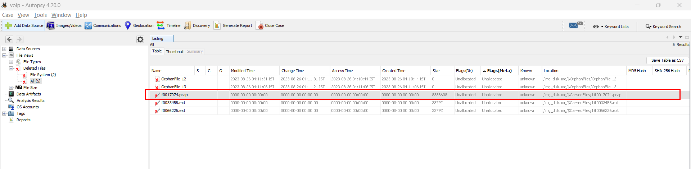
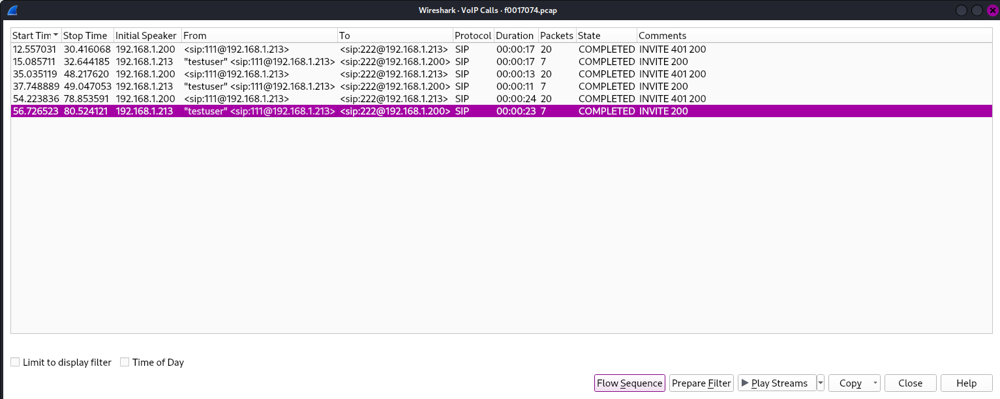

# Marian Croak

## Description
> Marian Rogers Croak is a Vice President of Engineering at Google. She was previously the Senior Vice President of Research and Development at AT&T. She holds more than 200 patents. She was inducted into the Women in Technology International Hall of Fame in 2013. In 2022, Croak was inducted into the National Inventors Hall of Fame for her patent regarding VoIP (Voice over Internet Protocol) Technology. She is one of the first two Black women to receive that honor, along with Patricia Bath. Her invention allows users to make calls over the internet instead of a phone line. Today, the widespread use of VoIP technology is vital for remote work and conferencing. - Wikipedia Entry

> Chal: Find the discarded flag and return it to this Hall of Fame Inventor

### Attachments
[Disk Image](https://drive.google.com/file/d/1htCVEWDKhAVzvZ1vMs6wzXWPcMir5ebB/view)
or 
[Voip.zip](./Voip.zip)

## Solution
* Using the `Sleuth Kit` CLI was of not much use.
* Opening the image file in `Autopsy` and looking at the `Deleted Files` tab we see a `.pcap` file.

* We can recover the deleted `.pcap` file and open it in `Wireshark`.
* Open the pcap file and look for VoIP Calls (`Telephony > VoIP Calls`)
* Listen to the last audio from `testuser` and we get the flag.


### FLAG
```
chctf{d3v3l0p3d_vo1c3_0v3r_1p}
```