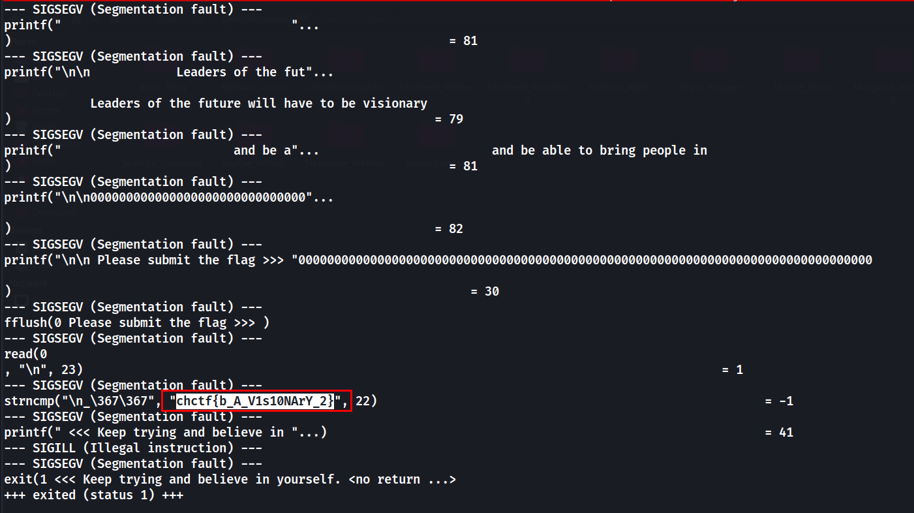

# Anita Borg

## Description
> Anita Borg (January 17, 1949 – April 6, 2003) was an American computer scientist celebrated for advocating for women’s representation and professional advancement in technology. She founded the Institute for Women and Technology and the Grace Hopper Celebration of Women in Computing. - Wikipeda Entry

> Chal: Have the vision to solve this binary and learn more about this visionary.

### Attachments
[fLag_TRACE](./fLag_TRACE)

## Solution
* From the binary name we get a hint that we need to use `ltrace`.
* `ltrace` is a program that Traces library calls of a given program.
* Running `ltrace` on the binary gives us the flag.

```zsh
$ ltrace ./fLag_TRACE
```


### FLAG
```
chctf{b_A_V1s10NArY_2}
```