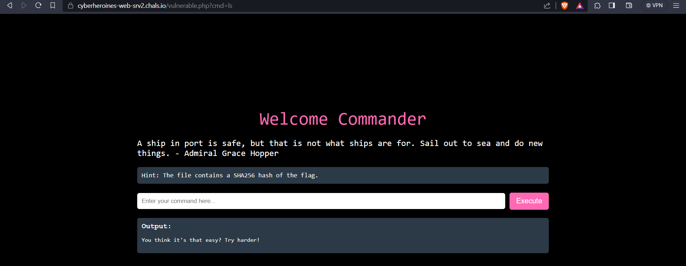
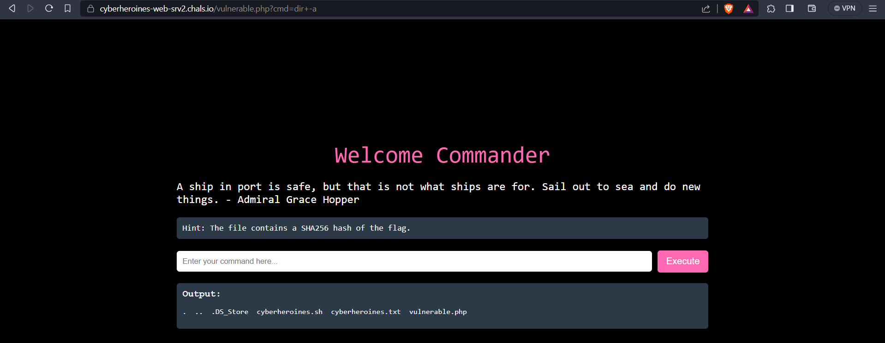
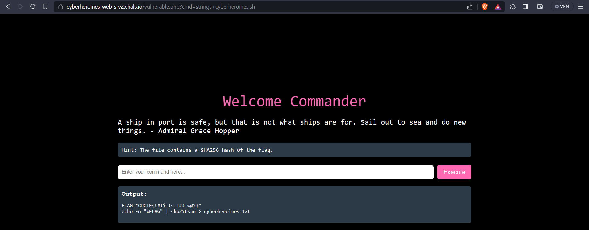

# Grace Hopper

## Description
> Grace Brewster Hopper (née Murray; December 9, 1906 – January 1, 1992) was an American computer scientist, mathematician, and United States Navy rear admiral. One of the first programmers of the Harvard Mark I computer, she was a pioneer of computer programming who invented one of the first linkers. Hopper was the first to devise the theory of machine-independent programming languages, and the FLOW-MATIC programming language she created using this theory was later extended to create COBOL, an early high-level programming language still in use today. - Wikipedia Entry

> Chal: Command this webapp like this Navy Real Admiral

## Challenge URL
[Challenge Link](https://cyberheroines-web-srv2.chals.io/vulnerable.php)

## Solution
* The challenge says to enter a command but `ls` does not work. 

* Use `dir -a` to list directory contents even hidden files

* `ls`, `cat`, `more`, `less`, `head`, `tail` commands are blacklisted.
* So to view file contents, we can use `strings` or just `grep` for the flag format to view file contents
* Running `strings` on `cyberheroines.sh` gives us the flag


### FLAG
```
CHCTF{t#!$_!s_T#3_w@Y}
```