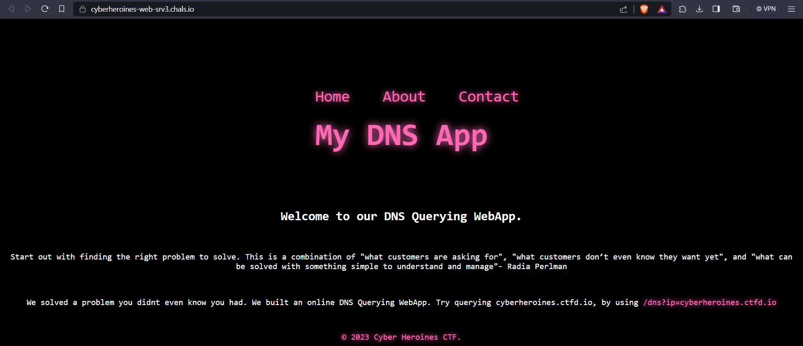
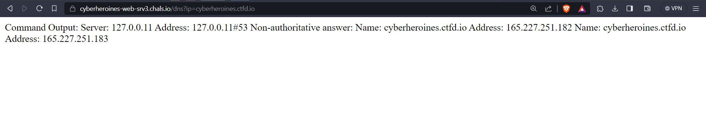
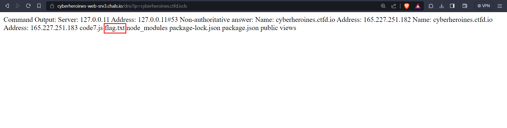
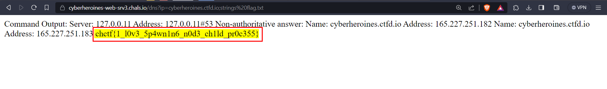

# Radia Perlman

## Description
> Radia Joy Perlman (/ˈreɪdiə/;[1] born December 18, 1951) is an American computer programmer and network engineer. She is a major figure in assembling the networks and technology to enable what we now know as the internet. She is most famous for her invention of the spanning-tree protocol (STP), which is fundamental to the operation of network bridges, while working for Digital Equipment Corporation, thus earning her nickname "Mother of the Internet". Her innovations have made a huge impact on how networks self-organize and move data. She also made large contributions to many other areas of network design and standardization: for example, enabling today's link-state routing protocols, to be more robust, scalable, and easy to manage. - Wikipedia Entry

> Chal: We thought we'd build a webapp to help the Mother of the Internet capture the flag.

### Challenge URL

[URL](https://cyberheroines-web-srv3.chals.io/)

## Solution
* This is a `Command Injection` challenge.
* It is a simple DNS querying webapp which runs nslookup and gives us the result

* On querying `cyberheroines.ctfd.io` we get this

* We can try running multiple commands using `;`.
* Listing files using `ls`, we find a `flag.txt` file

* Viewing the file using `cat`, `head`, `tail`, `more`, `less` is not possible as they are filtered.
* We can use `strings` to view the contents of the file.
    ```
    /dns?ip=cyberheroines.ctfd.io;strings flag.txt  
    ```
    

### VULNERABILITY: 

* The `child_process` module in Node.js enables the execution of system commands and scripts within a Node.js application. 
* Functions such as `child_process.exec()` and `child_process.execSync()` accept a command string and execute it on the server. 
* However, when user input is directly incorporated into these functions, it can create vulnerabilities susceptible to command injection.

### FLAG
```
chctf{1_l0v3_5p4wn1n6_n0d3_ch1ld_pr0c355}
```