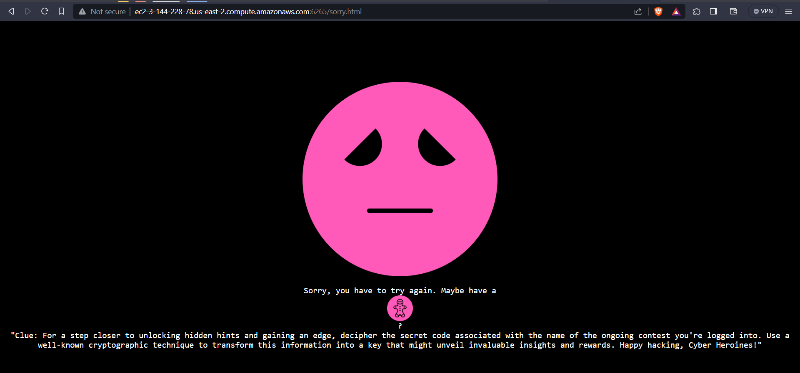
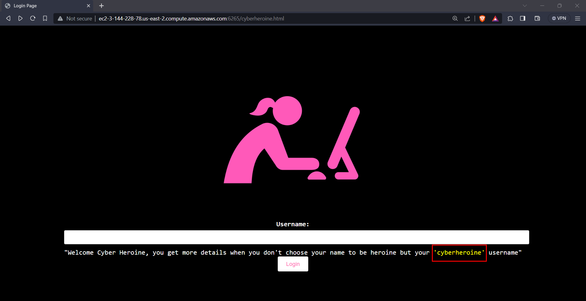
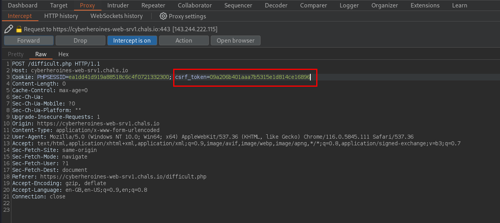
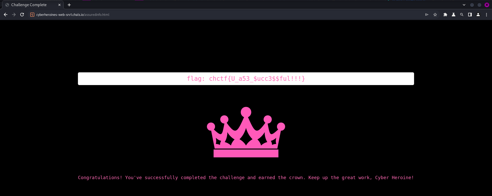

# Susan Landau

## Description
> Susan Landau (born 1954) is an American mathematician, engineer, cybersecurity policy expert, and Bridge Professor in Cybersecurity and Policy at the Fletcher School of Law and Diplomacy at Tufts University. She previously worked as a Senior Staff Privacy Analyst at Google. She was a Guggenheim Fellow and a visiting scholar at the Computer Science Department, Harvard University in 2012. - Wikipedia Entry

> Chal: Connect to our webserver and understand the concerns of this mathematician and privacy expert.


## Challenge link

[URL](https://cyberheroines-web-srv1.chals.io/)

## Solution
* On the landing webpage, clicking on `Start Exploring`, choosing a `username`, and then choosing any path leads us to a dead end.
* But 2 cookies named `csrf_token` and `PHPSESSID` are set.
* The clue in `/sorry.html` page mentions `well-known cryptographic technique`

* So we can crack `csrf_token` value using [crackstation.net](https://crackstation.net/)
* `40c331964b7560a4d3baaae420d5e3cd` md5 decrypt decodes to : `hack this`
* We get a hint that we should play around with the `csrf_token` value.
* In the login page, we have a hint

* Choosing `cyberheroine` as username.
* Replace the `csrf_token` with the `MD5 hash` of `cyberheroine`.
* Calculating the MD5 sum of `cyberheroine`
```shell
$ echo -n "cyberheroine" | md5sum                                
09a206b401aaa7b5315e1d814ce16896  -
```
* md5(cyberheroine): `09a206b401aaa7b5315e1d814ce16896`
* Intercept the request using `burpsuite` and modifying the `csrf_token` cookie value.



* We get the `flag`.



### FLAG
```
chctf{U_a53_$ucc3$$ful!!!}
```