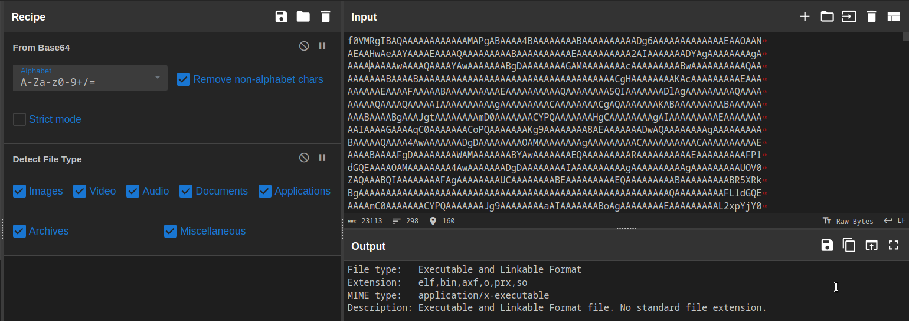

# Gibberish

## DESCRIPTION
> NASA receive a weird transmission yesterday but they were't able to decode it. I mean, it's just a bunch of gibberish. The only thing they have cracked was one word "goodbye"
They have no clue what that means though. Can you help them?  

> **FLAG FORMAT**:
dsc{[a-zA-Z0-9_]+}

## Solution
* Enter `flag.txt` contents in cyberchef and base64 decode it
* We see its an ELF executable file

* Copy the contents of the file and base64 decode it using [dcode.fr](https://www.dcode.fr/base-64-encoding)
* Download it to a file
* Now we have an executable
* Changing permissions of the executable and running it 
* It asks for a password
* Entering `goodbye` as password we get flag
* FLAG: `dsc{nc_c4n_4ls0_trnsmit_f1les}`
