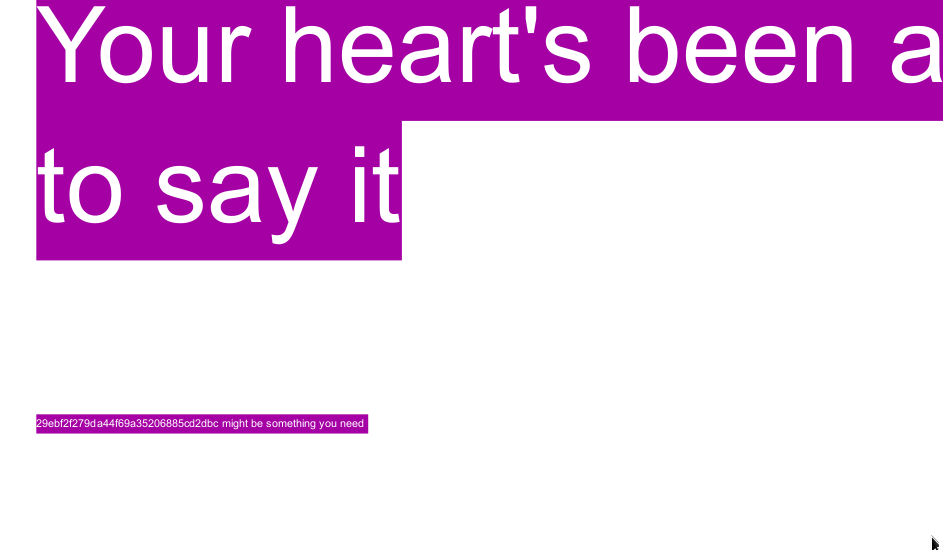

# Hash Roll

## DESCRIPTION
> Augustine's friend took a important file of augustine and stashed it.
He was able to grab all the files from his friend's machine but he is worried that the files are encrypted.
Help him get the file back  
> Author: Rakhul  
**FLAG FORMAT**:
dsc{[a-zA-Z0-9_]+}

## Solution
* We are provided with a encrypted zip file and a pdf
* Open the pdf and select all text 
* We find `29ebf2f279da44f69a35206885cd2dbc might be something you need` in really small font  

* Looks like a hash, we can decrypt using [crackstation.net](https://crackstation.net/)
* Decodes to `diosesamor`
* Extract the zip file using `diosesamor` as password
* We get a `jpg` file and flag at the bottom of the image
* FLAG: `dsc{N3v3r_9OnNA_gIv3_y0u_up}`
