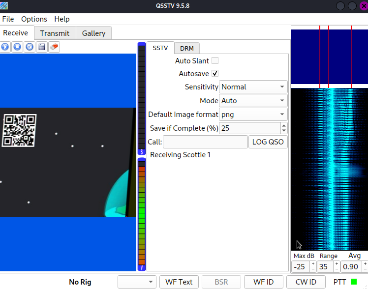

# Space Ahoy

## DESCRIPTION
> Brian tries to send some crucial information from the spacestation about an impending disaster through a super secure line to his friend through a picture.
Help his friend uncover the truth ..  
>Author: Rakhul  
>**FLAG FORMAT**:
dsc{[a-zA-Z0-9_]+}

## Solution
* Running strings on the given jpg file we can see there are 2 files embedded in it
    * SupEr_s3CrET_AuD10.wav
    * hidden.jpg
* There is an interesting comment which we can get by running `exiftool super_secret.jpg` which says
```bash
 Comment: the aliens are here try slowscan
```
* This comment will be useful later
* We can extract the files using `binwalk -e super_secret.jpg`
* We get `hidden.jpg` which has files embedded in it
* Again `binwalk -e hidden.jpg` gives us a wav file
* The comment comes into play here: the aliens are here try **slowscan**
* On reasearching about slowscan, I came across **Slow-Scan Television** which is picture transmission method.
* To decode this there is a tool called `QSSTV`. [Check this article for installation](
https://ourcodeworld.com/articles/read/956/how-to-convert-decode-a-slow-scan-television-transmissions-sstv-audio-file-to-images-using-qsstv-in-ubuntu-18-04)
* There is an alternate way to give the wav file to qsstv instead of using `pavucontrol`
    * Options > Configuration > Sound > Sound Input > From File
* After setting up QSSTV and running it we get an image with a qr code on the top left


* Scanning the qr code gives us the flag
* Flag:  
`dsc{un5af3_sp4C3_coD3}`

