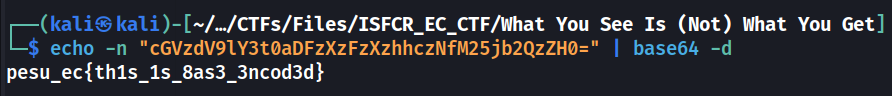

# CrackMe

## Description
> I am new to CTFs, can you unveil the hidden message for me?

[help.txt](./help.txt)
```
cGVzdV9lY3t0aDFzXzFzXzhhczNfM25jb2QzZH0=
```
## Solution
* The txt file containes a base64 encoded string. 
* Decoding it gives us the flag


### FLAG
```
pesu_ec{th1s_1s_8as3_3ncod3d}
```