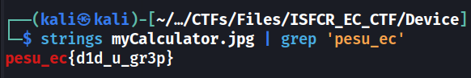

# Device

## Description
> Where's the flag?

[myCalulator](./myCalculator.jpg)

## Solution
* Scan the qr code and we get rick rolled.
* Running `strings` on the image and grepping for the flag format gives us the flag



### Flag
```
pesu_ec{d1d_u_gr3p}
```