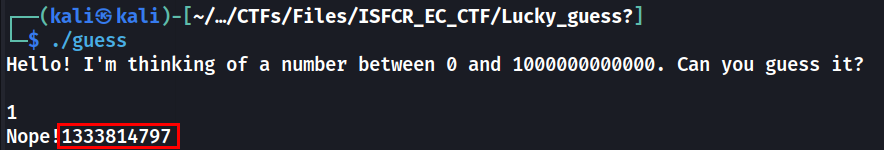
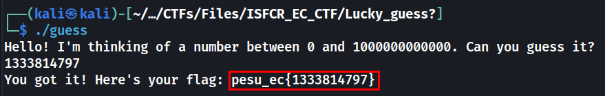

# Lucky Guess?

## Description
> Care to take a guess? Or do you even need to?

[guess](./guess)

## Solution
* Change permissions of the file using `chmod +x guess`.
* Running the file `./guess`
* Entering a random number tells us it is wrong and a number also is printed.

* Entering the number printed gives us the flag.


### FLAG: 
```
pesu_ec{1333814797}
```