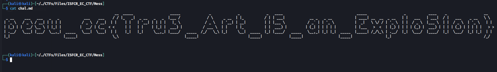

# Mess

## Description
> There are messy bits of ASCII characters everywhere. Please help meeeee!

[chal.md](./chal.md)

## Solution
* Viewing the file contents 
```
cat chal.md
```
* Upon zooming out the file contents, we can see the flag



### Flag
```
pesu_ec{Tru3_Art_15_an_Explo5ion}
```