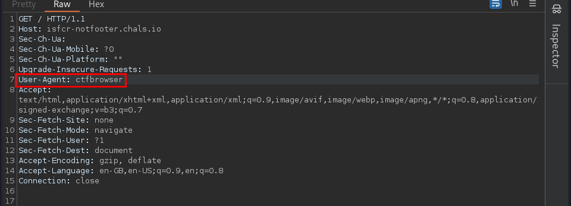
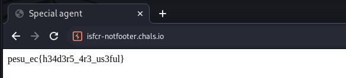

# NotFooter

## Description
> Wonder how http knows what browser i am using...

[url](https://isfcr-notfooter.chals.io/)
## Solution
* From the description, we can conclude that it is referring to the [User-Agent header](https://developer.mozilla.org/en-US/docs/Web/HTTP/Headers/User-Agent)
* We can see that it is expecting `ctfbrowser` as the User-Agent. This can be done in 2 ways:
    1. Intercept request using **BurpSuite** and change the **User-Agent** header
    2. Using curl

### Using BurpSuite
* Intercept the request using BurpSuite and change the User-Agent header to `ctfbrowser`


* Forward the request and we get the flag



### Using curl
* We can use curl to send a request with a custom User-Agent header
```bash
$ curl -A "ctfbrowser" https://isfcr-notfooter.chals.io/                                   
pesu_ec{h34d3r5_4r3_us3ful}
<title>Special agent</title> 
```
`-A`: To set the User-Agent header

### FLAG:
```
pesu_ec{h34d3r5_4r3_us3ful}
```