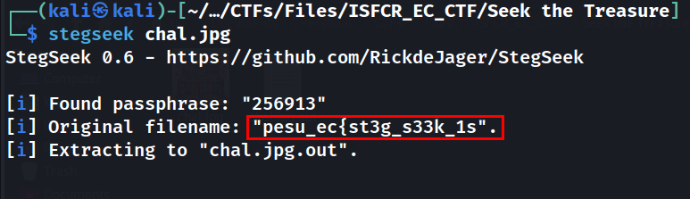

# Seek The Treasure

## Description
> Oh no, my treasure chest is locked with a 6-digit combination lock, can you open it and get me the treasure?

[chal.jpg](./chal.jpg)
## Solution
* Running `stegseek` we get the password `256913`
* We get the first part of the flag from the stegseek output in the `original filename`


* Second part of the flag is in `chal.jpg.out` file

### FLAG
```
pesu_ec{st3g_s33k_1s_ju5t_amaziNG}
```