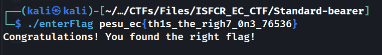

# Standard-bearer

## Description
> Enter flag, okay?

[enterFlag](./enterFlag)
## RETARDED Solution
* Running `strings` on the binary, we get multiple flags
* Manually trying each flag 🤡, we get the flag as `pesu_ec{th1s_the_righ7_0n3_76536}`



### FLAG
```
pesu_ec{th1s_the_righ7_0n3_76536}
```

## RIGHT Solution 
### [HERE](https://github.com/Mitul-Joby/PESUEC-CTF23-Official-Writeups/blob/main/Reverse%20Engineering/Standard-bearer/writeup.md)


