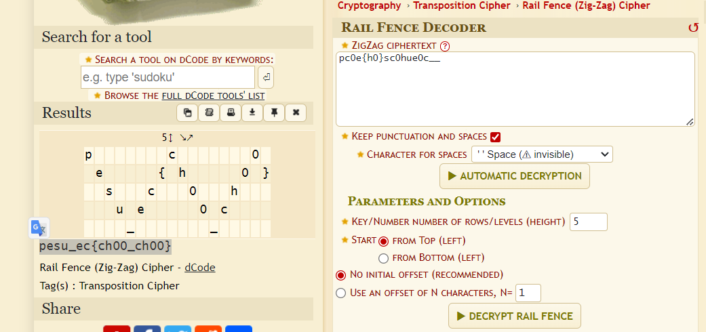

# Thomas The Train

## Description
> There are five trains waiting to cross, waiting for you to find the flag.

## Solution
* From the description we can infer that we have to decode using rail fence cipher with a step/height of 5.
* Using [dcode.fr](https://www.dcode.fr/rail-fence-cipher), we can decode the cipher.

### FLAG
```
pesu_ec{ch00_ch00}
```
