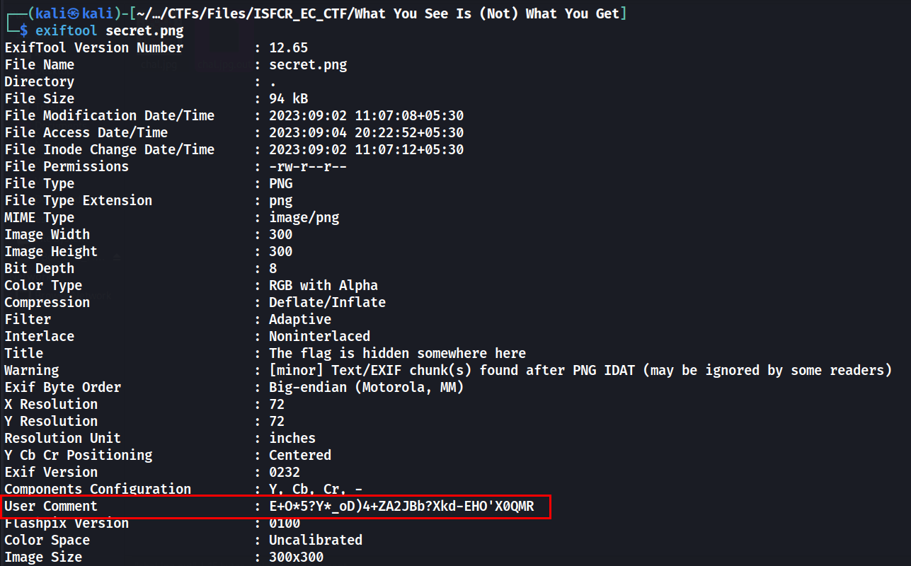

# What You See Is (Not) What You Get

## Description
> Can you find the flag in the image?

[secret.png](./secret.png)
## Solution
* Running `exiftool` on the image, there is a User Comment


* Using [dcode.fr](https://www.dcode.fr/cipher-identifier), we can identify the strings is encoded in  `ASCII85`
* Decoding the string using ASCII85, we get the flag
### FLAG
```
pesu_ec{m37ad4t4_c0nqu3r0r}
```