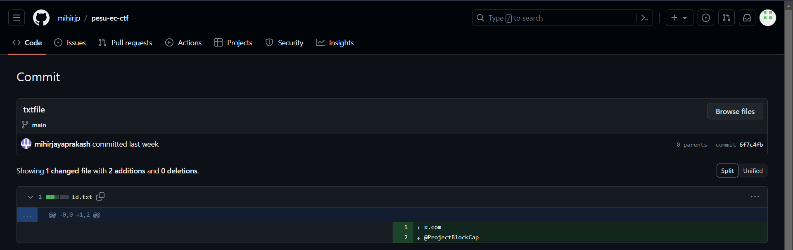
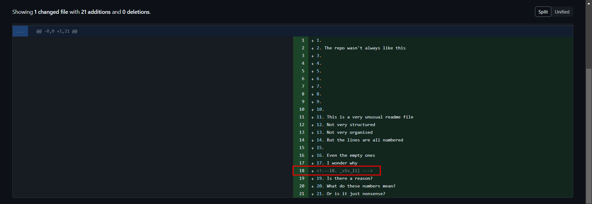

# splitXquest

## Description
>Examine the author's github repository thoroughly. Do you see everything? Is there anything hidden?  
Flag format: pesu_ec{<string>}  
Author: Mihir J P

## Solution
* Going to github and searching for `Mihir JP`, we find the [authors profile](https://github.com/mihirjp) with a repository named `pesu-ec-ctf`
* The readme file says `The repo wasn't always like this`, so we check the commits
* The first commit gives this 

* Visiting the twitter profile, bio contains this: `hwkm_wu{q0m`

* Rot18 gives us the first part of the flag `pesu_ec{y0u` 
* Checking the 2nd commit, we find this

* We see that the there is a comment on the 18th line, which looks like the 2nd part of the flag.
* ROT18 gives us the 2nd part of the flag `_d1d_1t}`
### FLAG
```
pesu_ec{y0u_d1d_1t}
```