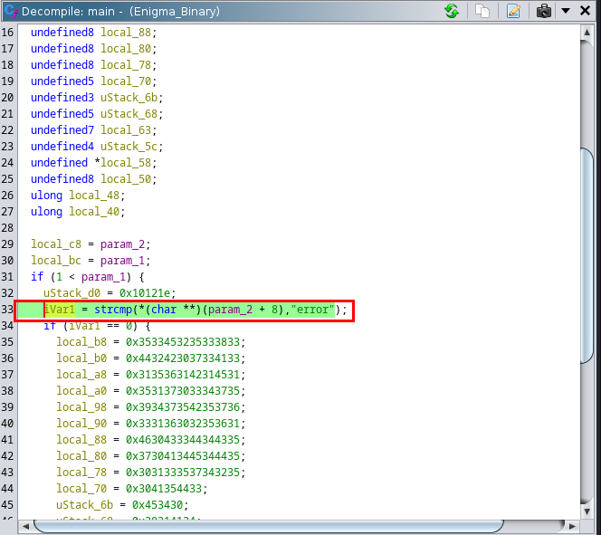
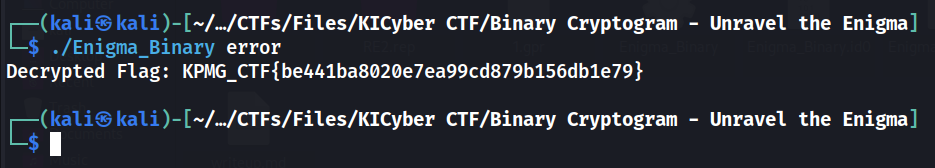

# Binary Cryptogram - Unravel the Enigma

## Description :
> A notorious organization, "The Enigma Syndicate," has sent encrypted messages detailing a dark conspiracy. Participants must tackle their binary cryptogram using powerful reverse engineering tool to reveal the sinister plot. Unravel the enigma, stop the conspiracy, and become the ultimate codebreaker in this thrilling CTF challenge!

## Solution :
* Open **Ghidra** and make a new project and import the executable provided.
* Double click on it and let it analyze and decompile the binary.
* Go to the main function and we can see that it is expecting `"error"` as an argument. And performs **strcmp** on it.

* Run the executable with error as an argument and we get the flag.

* Flag:   
`KPMG_CTF{be441ba8020e7ea99cd879b156db1e79}`
