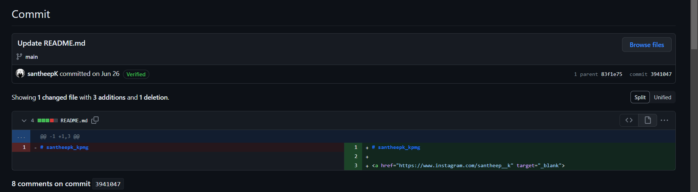

# Cross Platform Hunt

## Description
> https://github.com/HarshJolad/CTF-Writeups/blob/7566d799b809b353eb519e67e5e61d9d2c962e07/KPMG-CTF-2023/Welcome%20to%20KICyber%20CTF/Welcome-chall-writeup.mdTake a thrilling quest through various online platforms. Prepare to harness the power of OSINT as you navigate the interconnected web of GitHub to uncover a hidden flag. Who is Santheep K(santheepk_kpmg) ?

## Solution

* Look for `santheepk_kpmg` and we find [Github repository](https://github.com/santheepK/santheepk_kpmg).
* Look at the commits.

* We find a change was made and a link to instagram profile was added.
* Visiting the instagram profile we find a link to a Google Maps review.
* The Google Maps review gives us a username `santheep__k`
* We find a match on twitter for the username.
* The bio of the twitter profile gives us a base64 encoded string.
    `S1BNR19DVEZ7NTQ1YjU5YWRkMThhMjgxNDZjMjZkMjE5NjMxMjM3OWJ9Cg==`
* Decoding it gives us the flag.
* Flag:   
`KPMG_CTF{545b59add18a28146c26d2196312379b}`
