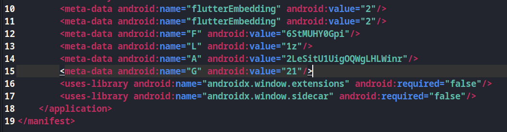

# MetaQuest

## Description
> Welcome to the Mobile MetaQuest CTF challenge, an exhilarating journey through the depths of mobile app mysteries. Dare to take on mind-boggling enigmas concealed within the app's realm. Navigate through obscure territories, uncover hidden fragments, and rise as the ultimate MetaQuest conqueror!

## Solution
* We are provided with an apk file.
* Decompile using apktool: 
`apktool d MetaQuest.apk`
* Go to the MetaQuest folder and open the `AndroidManifest.xml` file.
* Check the `meta-data` tags

* Base62 decode the string `2LeSitU1UigOQWgLHLWinr` 
* FLAG:   
`KPMG_CTF{M0B!L3_CH@LL3NG3}`
