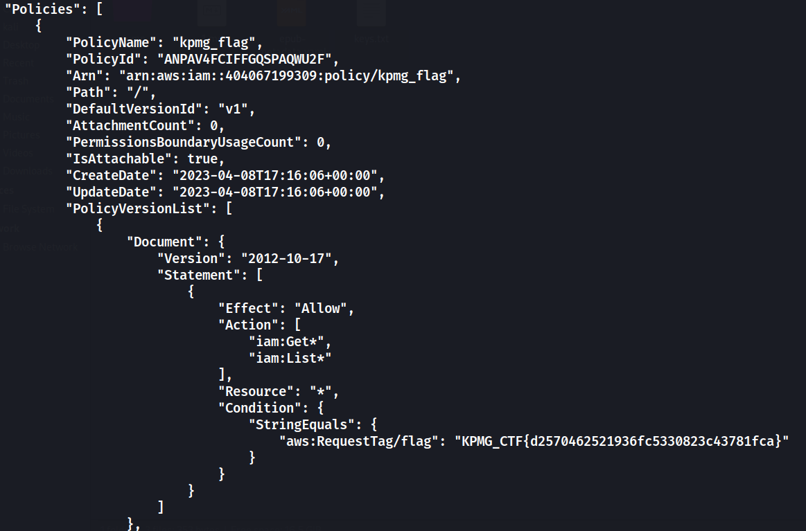

# Policy-patrol_IAM

## Description
> You'll assume the role of a vigilant security professional responsible for evaluating and enhancing IAM policies. Your objective is to identify potential security gaps across AWS accounts.   
`kpmg-ctf2.s3.ap-south-1.amazonaws.com`

## Solution
* Open the given s3 bucket link, it gives an xml file listing all the files in the bucket.
* We can also list the bucket contents using the AWS cli:  
`aws s3 ls s3://kpmg-ctf2 --no-sign-request`
* Going through the files we find an interesting file named `aws.json`
* It contains the **AWS Access Key ID** and **Secret Access Key**  for an IAM user:   
`/resources/flash_cards/aws.json`
* We can setup a profile using the **AKID** and **Secret Access Key**  
`aws configure --profile KICTF`
* Enter the Access Key ID and Secret Access Key (**DONT FORGET TO CONFIGURE THE REGION!!!**)
* We can now use this tool to enumerate the IAM policies for the profile: [IAM Enumerate](https://github.com/andresriancho/enumerate-iam)
* We get the flag in one of the policies with the name `kpmg_flag`

* Flag:   
`KPMG_CTF{d2570462521936fc5330823c43781fca}`
