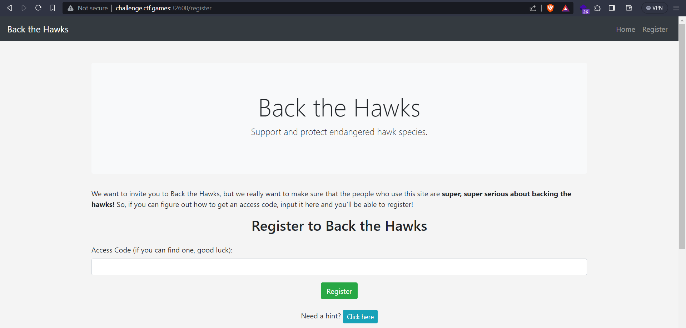
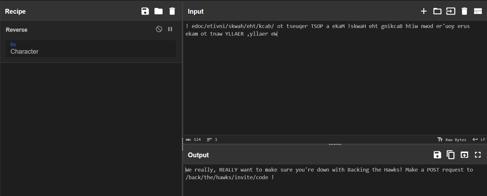
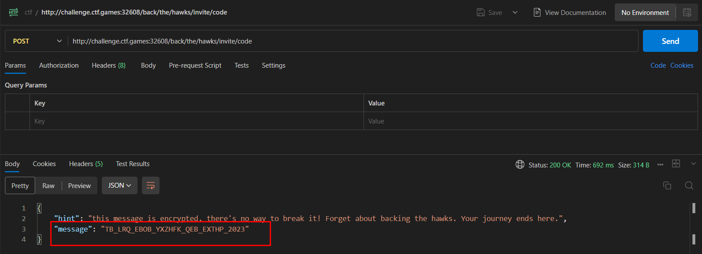

# Back The Hawks

## Challenge Description
> We are Back the Hawks! We're a non-profit that seeks to protect hawks across the world. We have a vibrant community of Backers who are all passionate about Backing the Hawks! We'd love for you to join us... if you can figure out how to get an access code.

> NOTE - any resemblence to other companies, non-profits, services, login portal challenges, and/or the like, living or dead, is completely coincidental.

## Solution
* Visting the `Register` page, asks for an `Access Code`

* Checking the Hint on the page

* Checking the javascript file `backTheHawksInviteCodes.min.js`
```javascript
function makeInviteCode() {
    var o = "! edoc/etivni/skwah/eht/kcab/ ot tseuqer TSOP a ekaM !skwaH eht gnikcaB htiw nwod er'uoy erus ekam ot tnaw YLLAER ,yllaer eW";

    var d = o.split('').reverse().join('');

    console.log(d);
}
```
* Reverse the string of characters

* It says `Make a POST request to /back/the/hawks/invite/code`

* We get a message after making a POST request to that endpoint
* Decrypting the message using `Shift Cipher` with shift of `23`, we get : `WE_OUT_HERE_BACKIN_THE_HAWKS_2023`
* Enter the access code on the `Register` page and we get the flag

### FLAG
```
flag{3ef532159716ecfb9117f56f4ead4fb6}
```