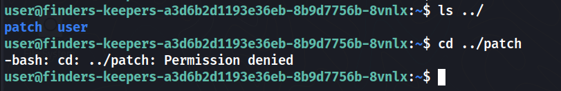
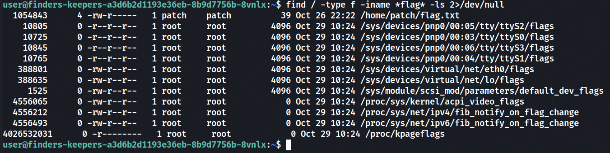
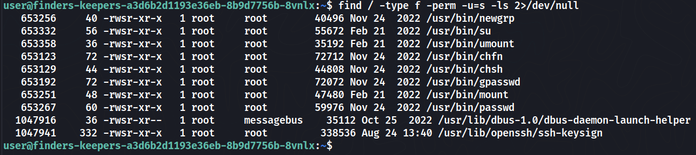
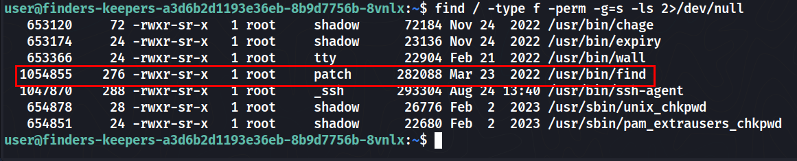
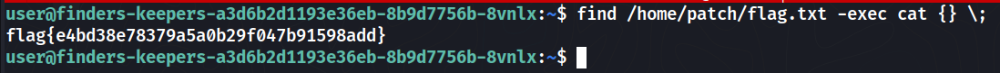

# Finders Keepers

## Challenge Description
> Patch found a flag! He stored it in his home directory... should be able to keep it?

## Solution
* From the description, we know that the flag is in the home directory of the user `patch`.
* But we cannot access the home directory of `patch` because we don't have the permission to do so.

* `sudo` wasnt even there 💀

* Looking for the flag using `find`

* Looking for interesting binaries with `suid` bit set but nothing

* Looking for interesting files with `sgid` bit set, we find the `find`

* Using `find` we can get the flag


### Flag
```
flag{e4bd38e78379a5a0b29f047b91598add}
```
