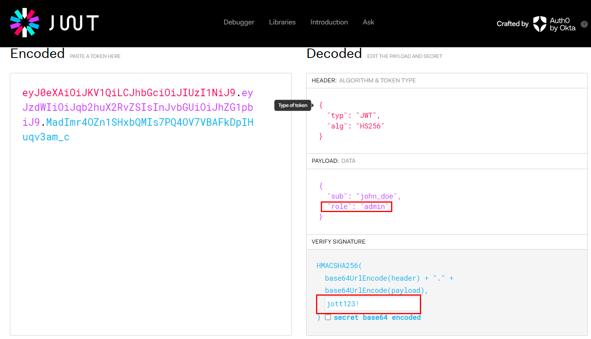

# Jott

## Challenge Description
> Jott is the new hottness of productivity applications! Collaborate in real time, share notes, take notes, or don't take notes! We're not your manager. We're not even a real company!

> Go ahead and pentest the application and jott down whatever you find.

> We'd like you to do a pretty thorough job, so we've outfitted you with a dev instane of the app. Please use these user level credentials to log in and perform an aunthenticated test.

> Username- john_doe
> Password - password123

> We also gave you the dev-build of the app in the src directory for reference.

## Attachments
* [src.zip](./src.zip)

## Solution
* Logging in with the credentials given
* Going through `app.py`, we find a `SECRET_KEY`
* Grabbing the `jwt` token from the cookie
* Decode the jwt token using [jwt.io](https://jwt.io/)
* Editing the jwt token by changing the `role` from `user` to `admin` and encoding it with the secret found in `app.py`

* Replacing the jwt token in the cookie and refreshing the page, we get the flag

### FLAG
```
flag{c7cc7fa86330cff2c09cea0055289b7e}
```