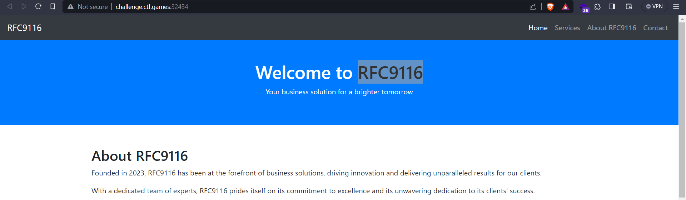
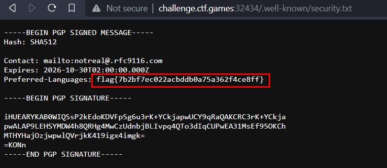

# Nine-One-Sixteen

## Challenge Description
> We found a vulnerability in this company's software and we are trying to do responsible disclosure! We want to notify the organization and contact them about the security issues... can you track down their contact info?

## Solution
* Visting the website

* We see `RFC9116`, which is a file format that helps with security vulnerability disclosures
* Reading more baout RFC 9116, we find a `security.txt` file under the `/.well-known/` directory
* Going to `/.well-known/security.txt`, we find the flag


### FLAG
```
flag{7b2bf7ec022acbddb0a75a362f4ce8ff}
```