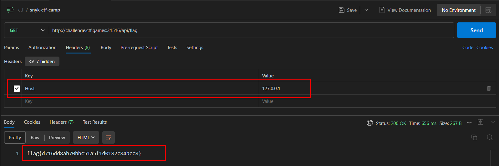

# Protecting Camp

## Challenge Description
> I made a small site to keep a list of things I need to buy to keep me safe before I go camping, maybe it's keeping some other things safe too!

## Attachments
* [protecting_camp.zip](./protecting_camp.zip)

## Solution
* Going through the code, it looks vulnerable to `SSRF`(Server Side Request Forgery) 
* In the `index.js` file
```js
app.get('/api/flag',  (req, res) => {
    var url = req.protocol + '://' + req.get('host') + req.originalUrl;
    try{
        parsed = parseUrl(url)
        if (parsed.resource != '127.0.0.1'){
            res.send("Hey... what's going on here\n");
        }else{
            fs.readFile("./flag.txt", 'utf8', (err, data) => {
                if (err) {
                    res.send("There was an error and this is sad :(\n")
            
                }else{
                    res.send(data+"\n")
                }
            });
    }} catch (error) {
        res.status(400).json({ success: false, message: 'Error parsing URL' });
    }
      
});
```
* We can see theres a `/api/flag` endpoint that reads the `flag.txt` file
* Sending a request to `/api/flag` will return `Hey... what's going on here`
* In the `index.js` we see that the server is looking for request coming from `127.0.0.1` which is the localhost
* Adding the `Host` header with value as `127.0.0.1` and sending the request to `/api/flag`, we get the flag


### FLAG
```
flag{d716dd8ab70bbc51a5f1d0182c84bcc8}
```
