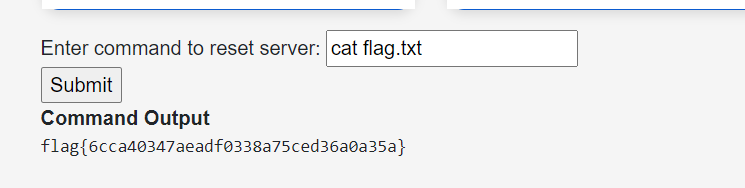

# Unhackable Andy II

## Challenge Description
> Andy's back and... he hasn't learned much, has he?

## Solution
* Next part of [Unhackable Andy](../Unhackable%20Andy/readme.md)
* In the github profile, there's another [repo](https://github.com/unhackableandy/my-other-awesome-site)
* Cloning the repo and looking at the `env`, we get the credentials
```
git clone https://github.com/unhackableandy/my-other-awesome-site.git
cd my-other-awesome-site
git show env
```
* Logging in with the credentials and running `ls` and using `cat flag.txt`, we get the flag


### FLAG
```
flag{6cca40347aeadf0338a75ced36a0a35a}
```