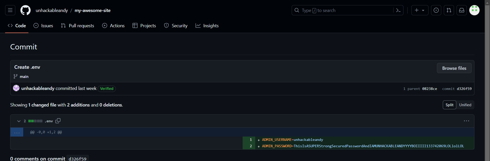
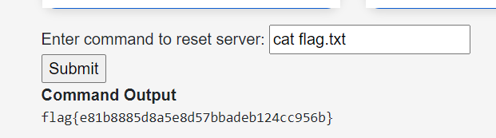

# Unhackable Andy

## Challenge Description
> Someone might want to let ol' Andy know the old addage - pride goeth before the fall. 

## Solution
* On opening the website, theres a homepage and a login page 
* On the home page theres a [GitHub link](https://github.com/UnhackableAndy) 
* There is a repo named `my-awesome-site`
* Looking at the commits and in the `.env` file, we find the login credentials

* Using the credentials we can login to the website and we find a box to run commands
* Running `ls`, we see theres a `flag.txt` file
* Running `cat flag.txt`, we get the flag  


### FLAG
```
flag{e81b8885d8a5e8d57bbadeb124cc956b}
```