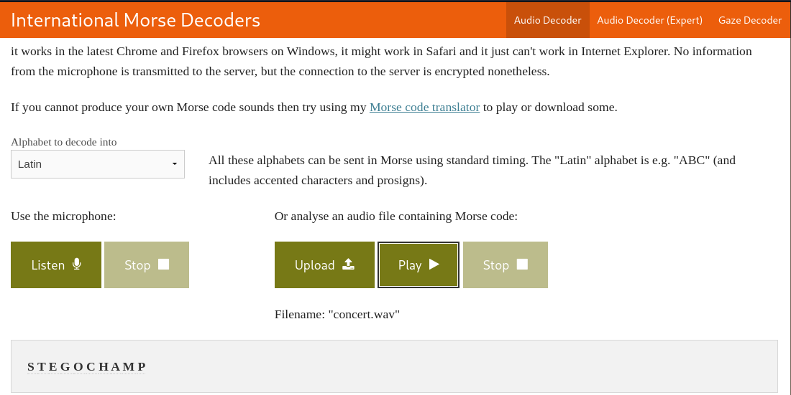

# Cat's Concert 🎧🎵


## Challenge Description
> In the vibrant city of Technoville, there lived a renowned musician, Mr. Meow, who was famous for his unique compositions. Little did people know that hidden within his mesmerizing melodies was a message waiting to be deciphered.!!

> Flag Formate : xCTF{}

## Attached files
* [AnsiChar](./AnsiChar)
* [concert.jpg](./concert.jpg)

## Solution
* Running `strings`, `binwalk`, `exiftool` on `concert.jpg` gives nothing useful.
* Using `stegseek` on `concert.jpg` we see theres a `wav` file hidden in the image.
```bash
$ stegseek --crack concert.jpg
StegSeek 0.6 - https://github.com/RickdeJager/StegSeek

[i] Found passphrase: "qwertyuioplkjhgfdsazxcvbnm"
[i] Original filename: "hidden.wav".
[i] Extracting to "concert.jpg.out".
```
* The `wav` file is a morse code.
* Using [morse code decoder](https://morsecode.world/international/decoder/audio-decoder-adaptive.html) we get the hidden message.


## FLAG
```
xCTF{STEGOCHAMP}
```
