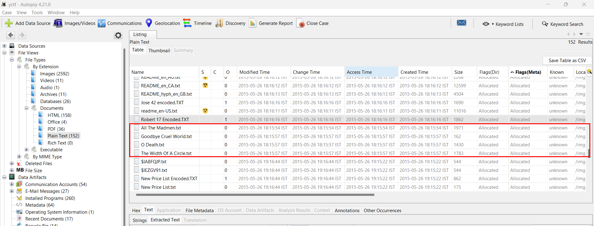

# Death Song

## Challenge Description
> In this haunting song, the narrator pleads with death for a reprieve, describing death as an unstoppable force that claims both the young and old, regardless of wealth or status, and portrays it as a relentless entity with power over life and the afterlife.

> Jimmy loves to write down lyrics of the songs. Find the writer of the song which relates to the above.

> Flag format: xCTF{Firstname_Lastname}

## Attached files
* [Google Drive](https://drive.google.com/file/d/1FgVnISIXjyV9Rc7rm9phZY2hXDg2GRLB/view)
* [ZIP file](./JimmyWilson.zip)

## Solution
* We are given zip file with `E01` file. 
* `E01` extension stands for EnCase image file format used by EnCase software.
* This can be opened using Autopsy and setting up the case
* After setting up the case, we can see the files in the image.
* According to the description, we are looking for files with song lyrics.
* So we can look for files with `.txt` extension. We can look for these on the left side Directory tree   
`File Views > File Types > By Extension > Document > Plain Text`
* Scrolling down we find a few txt files with lyrics.

* Closest lyrics to the description is `O Death.txt`
* The lyrics are from the song `O Death` by `Lloyd Chandler`

## FLAG
```
xCTF{Lloyd_Chandler}
```
