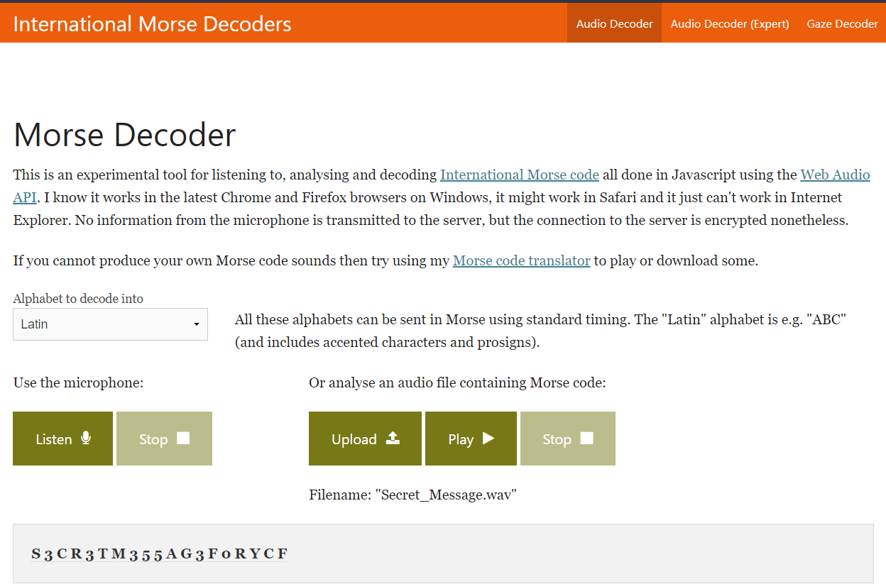

# Military Spy

## Challenge Description
> My Indian friend is a spy in US military, he wants to send secret message to me.

> Help me decrypt his message.

> Flag format: xCTF{SECRET_MESSAGE}
## Attached files
* [secret_message.wav](./Secret_Message.wav)
## Solution
* Using [morse code decoder](https://morsecode.world/international/decoder/audio-decoder-adaptive.html), we get the following message:
```
S3CR3TM355AG3F0RYCF
```

* Adding underscores to the message, we get the flag:
## FLAG
```
xCTF{S3CR3T_M355AG3_F0R_YCF}
```


