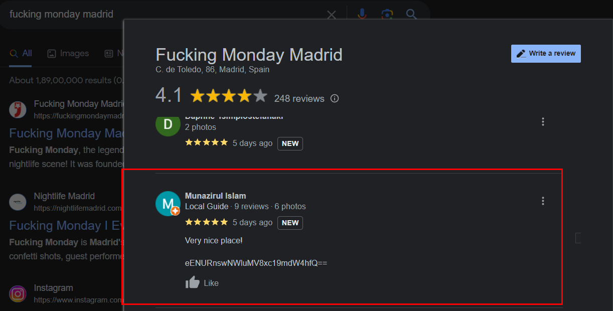

# OSINT 1

## Challenge Description
> Flag is somewhere around google maps, can you pick it? It's easy lol!

> Remember, it's not the place where he lives!

> Link: https://munazir.com

## Solution
* Visiting the author's website, we see a link to his twitter account.
* Visiting his twitter account, we see a location: `Fucking monday madrid`

* Checking the reviews for the location on google, we see a review by the author.

* It has a base64 encoded string
* Decoding the string, gives us the flag.
```
$ echo -n "eENURnswNWluMV8xc19mdW4hfQ==" | base64 -d
xCTF{05in1_1s_fun!}
```
## FLAG
```
xCTF{05in1_1s_fun!}
```