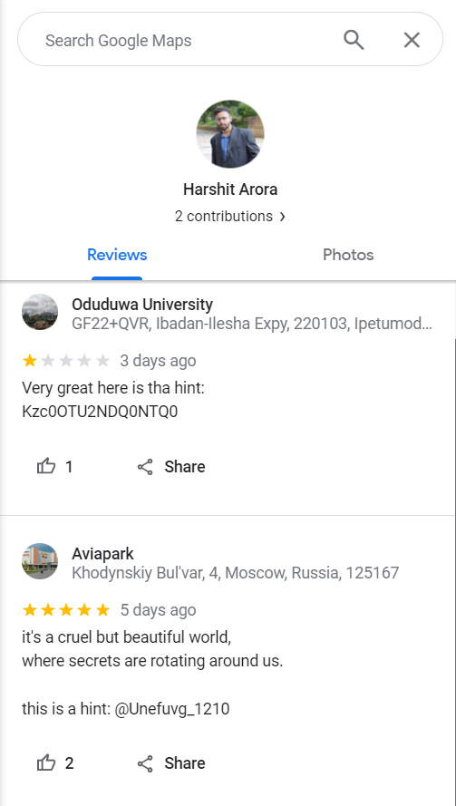
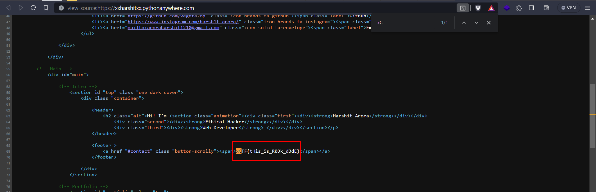

# OSINT 2

## Challenge Description
> My friend wrote a very bad review about the place where he studies.

> But he didn't disclose where he studies, but I just have these information:

> 7.4956,4.44544

## Solution

* Looking for an educational institution near the coordinates, gives us `Oduduwa University`
* Checking the reviews for the institution, we see a review left by the challenge author
* Looking for other reviews by the author, we see another review left by him for a shopping mall `Aviapark`


* The second hint: `@Unefuvg_1210`, after ROT13 decoding, gives us `@Harshit_1210`
* Looking for the author on twitter, his bio has a website link  

<br><br>
* Viewing the page source of website and searching for the flag format, we get the flag



## FLAG
```
xCTF{tHis_is_R03k_d3dE}
```
