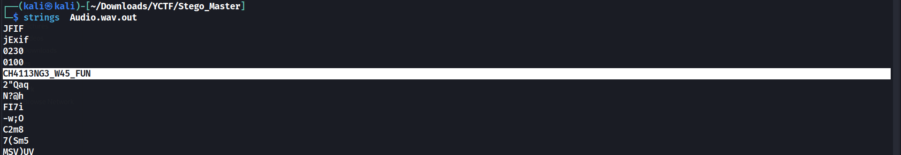

# Stego Master

## Challenge Description
> My friend wants to convey something in his voice....

> Flag format: xCTF{}

## Attached files
* [audio.wav](./Audio.wav)

## Solution
* Morse decoding the audio gives us `R A B B I T H O L E ?`
* So we try to extract the hidden file using `stegseek`

```
$ stegseek --crack Audio.wav 
StegSeek 0.6 - https://github.com/RickdeJager/StegSeek

[i] Found passphrase: "1qaz2wsx"       
[i] Original filename: "e.jpg".
[i] Extracting to "Audio.wav.out".
```
* We get a `jpg` file
* Running `strings` on the file gives us a string

* Enclosing the string in the flag format is the flag

## FLAG
```
xCTF{CH4113NG3_W45_FUN}
```