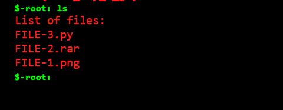
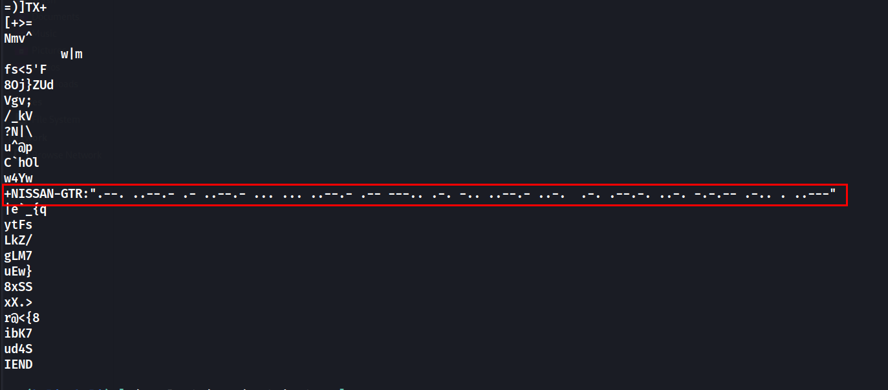
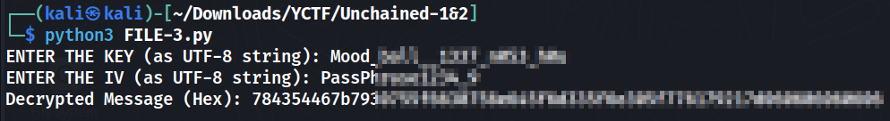

# Unchained 2

## Challenge Description
> "Go from hacking web to solving puzzles"

> Wow! You helped admin to recover his password! Now help him recover his lost rar password

> Good Luck!

> (It's the continuation of Unchained 1!)

**Challenge link**: https://harsh1tarora.pythonanywhere.com/

## Solution
* This is the continuation of Unchained 1
* Using `ls` we can list the files

* We can also download these files using `download` command
```
download FILE-1.png
download FILE-2.rar
download FILE-3.py
```
* After downloading the files, running `strings` on the png file gives us 



* Decoding using morse gives us `P_A_SS_W8RD_FR@F!LE2`
* Unzip the `rar` file using the password `P_A_SS_W8RD_FR@F!LE2`, gives us a `key.txt` file
* the `key.txt` file contains the key and IV, which will be used when we run the `FILE-3.py` file
* Running the `FILE-3.py` file with the key and IV gives us the a `hex` string.


* Decoding the `hex` string gives us the flag
```python
$ python3
Python 3.11.5 (main, Aug 29 2023, 15:31:31) [GCC 13.2.0] on linux
Type "help", "copyright", "credits" or "license" for more information.
>>> bytes.fromhex('784354467b7930755f6630756e645f6d335f6e305f776179217d060606060606').decode()
'xCTF{y0u_f0und_m3_n0_way!}\x06\x06\x06\x06\x06\x06'
>>>
```

## FLAG
```
xCTF{y0u_f0und_m3_n0_way!}
```
