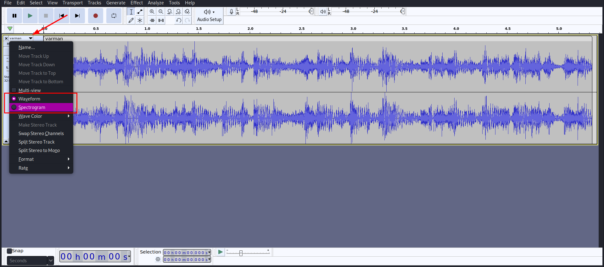
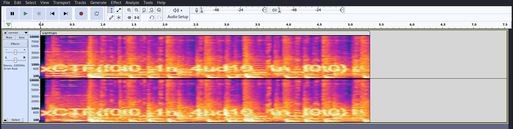

# Inception

## Challenge Description
> My friend got inspired by Inception movie and sent this strange image. Can you discover what is this image about ?

## Attached files
* [leaff.jpg](./leaff.jpg)
## Solution
* Running `strings`, `binwalk`, `exiftool` on `leaff.jpg` gives nothing useful.
* Using `stegseek` to extract data from `leaff.jpg` gives us a `wav` file.
* Opening it in audacity and viewing the spectogram gives us the flag
* To view the spectogram in audacity
* Open the file in audacity and on the left hand side of the screen, click on the dropdown menu and select spectogram.

* Select `spectogram`.

## FLAG
```
xCTF{f0t0_1n_4ud10_1n_f0t0}
```
